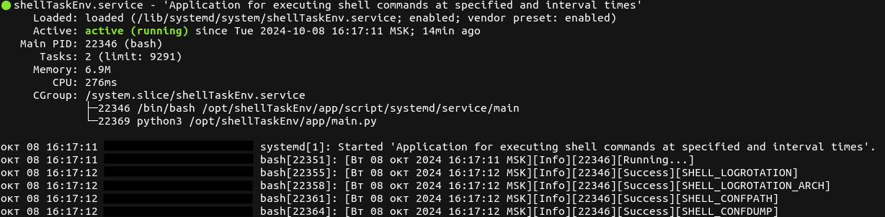

Instructions for using the application.
---
The `shellTaskEnv` application is designed to simplify task management in the command-line environment, allowing `Linux` users to schedule the execution of tasks at specified times. Built on standard `Python` modules, it is accessible without the need for additional library installations. In this guide, we will explore the main features and capabilities of the application.

### Contents:
1. [Installation.](#1-installation)
* 1.1 [Setting up and starting manually.](#11-setting-up-and-starting-manually)
* 1.2 [Automatic configuration and startup of systemd.](#12-automatic-configuration-and-startup-of-systemd)
2. [Application Management.](#2-application-management)
* 2.1 [Configuring the TASK parameter.](#21-configuring-the-task-parameter)
    * 2.1.1 [Configuring IntervalTask.](#211-configuring-intervaltask)
    * 2.1.2 [Configuring PlanTask.](#212-configuring-plantask)
* 2.2 [Configuring the LOGROTATION parameter.](#22-configuring-the-logrotation-parameter)
* 2.3 [Configuring the CONFDUMP parameter.](#23-configuring-the-confdump-parameter)
3. [Conclusion.](#3conclusion)

### 1. Installation.
---
To install the application, run the following commands:
```
cd /opt
sudo git clone https://github.com/AlexKira/shellTaskEnv.git
sudo
```
> **Note:**\
    When executing the `chown` command, replace the directives:\
    `<username>` - with your username;\
    `<usergroup>` - with the name of your user group.

### 1.1 Setting up and starting manually.
---
To configure and run the application manually, run the following commands:
```
cd /opt/shellTaskEnv/
python3 -m venv .venv
source .venv/bin/activate
python3 app/main.py
# exit
CTRL + C
```
After executing the commands, two subdirectories, `log` and `settings`, will appear in the `/opt/shellTaskEnv` directory.\
`log` - this subdirectory contains files with the application's output data. The default file is `shellLogEnvApp.log`.\
`settings` - this subdirectory holds the main configuration file, `conf.json`.\
Below, there will be a description of how to interact with these subdirectories.


### 1.2 Automatic configuration and startup of systemd.
---
> **Note:**\
    This installation has been tested on `Debian` family operating systems.

To automatically configure and install an application in `systemd`, run the following commands:
```
cd /opt/shellTaskEnv/app/script/systemd
chmod +x info
chmod +x install
chmod +x uninstall
```

Let's break down the following bash scripts:
- `info` - this bash script retrieves information about the status of the `shellTaskEnv.service` and is run by a regular user.
- `install` - this bash script installs and configures the `shellTaskEnv.service` and is run by the `root` user.
- `uninstall` - this bash script removes the `shellTaskEnv.service` and is run by the `root` user.

Next, to install, follow the next step:
```
sudo ./install
# or
sudo bash install
```
After which the following status will appear:



> **Note:**\
    If you have a status of `inactive`, check the installation steps in this guide and review the system log for the `shellTaskEnv.service`. You can run the `info` script or use the command `journalctl -u shellTaskEnv.service --lines=20`. This command will display the last 20 lines of the log related to the service, which will help you diagnose the problem. It is assumed that you understand how the `systemd` service works and can resolve the issue independently.

After performing the operations, a log file named `shellEnvAppService.log` will appear in the `log` subdirectory, where the output data from the `shellTaskEnv.service` will be recorded.

The following commands were used to manage the `shellTaskEnv.service` service:
```
# Request status
systemctl status shellTaskEnv.service 

# Request stop
sudo systemctl stop shellTaskEnv.service

# Request start
sudo systemctl start shellTaskEnv.service

# Request restart
sudo systemctl restart shellTaskEnv.service
```
> **Note:**\
    Management of the `shellTaskEnv.service` is carried out by the `root` user, who has full access to the system and can perform any administrative tasks.

If the `shellTaskEnv.service` service is not needed, perform the removal procedure with the following command:
```
sudo ./uninstall
# or
sudo bash uninstall
```


### 2. Application Management.
---
To manage the `shellTaskEnv` application, a configuration file named `conf.json` is located in the `settings` subdirectory. This file contains various configuration parameters, which are detailed as follows:

- `CONFPATH` - this specifies the path to the main settings file, defaulting to `/opt/shellTaskEnv/settings/conf.json`.

- `TASK` - this parameter is responsible for executing commands based on a specified date and time ([link](#21-configuring-the-task-parameter)).

- `LOGROTATION` - this involves the archiving, cleaning, and deletion of application log files. This procedure helps manage log size and prevents disk space overflow by automatically removing old entries ([link](#22-configuring-the-logrotation-parameter)).

- `CONFDUMP` - this parameter allows for creating a copy of the main settings file. By default, the copy is made in the `/opt/shellTaskEnv/dump` directory, resulting in a file named `copy_conf.json` ([link](#23-configuring-the-confdump-parameter)).

### 2.1 Configuring the TASK parameter.
---
Let's open the `conf.json` file, which is located in the `settings` subdirectory. Let's find the `TASK` parameter and study it in more detail:
```
"TASK": {
    "0": {
        "DATE_TIME": {
            "MONTH": "",
            "DAYS": "",
            "HOURS": "",
            "MINUTE": ""
        },
        "EXECUTE": {
            "SHELL": []
        }
    }
}

# Scheme (JSON):
"string": {
    "string": {
        "string": {
            "string": string,
            "string": string,
            "string": string,
            "string": string
        },
        "string": {
            "string": array
        }
    }
}
```

**Explanation of components**:

- `TASK` - this is the name of the parameter that contains all the tasks that will be executed.
- `0` - this is the task identifier ranging from `0` to `n`. Each task has a unique identifier. In this case, it is `0`, but you can add more tasks with different identifiers. For example:
```
"0": {
    "DATE_TIME": {
        "MONTH": "",
        "DAYS": "",
        "HOURS": "",
        "MINUTE": ""
    },
    "EXECUTE": {
        "SHELL": []
    }
},
"1": {
    "DATE_TIME": {
        "MONTH": "",
        "DAYS": "",
        "HOURS": "",
        "MINUTE": ""
    },
    "EXECUTE": {
        "SHELL": []
    }
}
```
- `DATE_TIME` - this object defines the schedule for tasks:
    - `MONTH` - specifies the month in which the task should be executed. Values can range (from 1 to 12).
    - `DAYS` - specifies the day of the month when the task should be executed. Specific days can be indicated.
    - `HOURS` - specifies the hours during which the task should be executed (from 0 to 23).
    - `MINUTE` - specifies the minutes during which the task should be executed (from 0 to 59).
- `EXECUTE` - this object defines which commands should be executed:
    - `SHELL` - this is an array for adding commands that will be executed according to the specified schedule. For example:
```
"0": {
    "DATE_TIME": {
        "MONTH": "*",
        "DAYS": "*",
        "HOURS": "*",
        "MINUTE": "*"
    },
    "EXECUTE": {
        "SHELL": [
            "ps -aux"
        ]
    }
},
"1": {
    "DATE_TIME": {
        "MONTH": "*",
        "DAYS": "*",
        "HOURS": "*",
        "MINUTE": "*/10"
    },
    "EXECUTE": {
        "SHELL": [
            "cat /proc/meminfo",
            "python3 -c 'import this'"
        ]
    }
}
```

Tasks are divided into two types: `IntervalTask` and `PlanTask`.
- `IntervalTask` - these are tasks that are executed periodically at a set [interval](#211-configuring-intervaltask).
- `PlanTask` - these are tasks that are executed at [scheduled](#212-configuring-plantask) times a specified number of times per year, month, day, hour, or minute.

**Symbols used for adding tasks:**
- `""` - indicates that the task is disabled.
- `*` - indicates that the task is enabled, adding the current date or time.
- `*/n`, `*/n.n`, or `n.n` - used for adding to `IntervalTask`, where the type of addition can be __whole numbers__ or __floating-point numbers__.
- `*n` or `n`- used for adding to `PlanTask`, where the type of addition must be strictly __whole numbers__.

> **Note:**\
    If you are using the `shellTaskEnv.service`, after making changes to the `settings/conf.json` file, restart the service with the command: `sudo systemctl restart shellTaskEnv.service`. After this, all settings will be applied. Restarting the service allows the system to reload the configuration and apply the changes made.

### 2.1.1 Configuring IntervalTask.
---
Let's consider approaches to setting the `IntervalTask` task.
```
"0": {
    "DATE_TIME": {
        "MONTH": "*",
        "DAYS": "*",
        "HOURS": "*",
        "MINUTE": "*/1"
    },
    "EXECUTE": {
        "SHELL": [
            "cat /proc/meminfo",
            "python3 -c 'import this'"
        ]
    }
}
```
After setting these parameters, the task will be executed every `1 minute`. To confirm that the task has been scheduled for execution, check the log file: `log/shellLogEnvApp.log`. In this file, you will be able to see entries regarding the execution of your task. Once the task is completed, it will automatically extend for the next minute, meaning it will continue to execute at the specified interval. This allows you to avoid worrying about manually starting the task each time. 

If you specify a floating-point number in the `MINUTE` parameter, the time will be calculated in `seconds`. This is only applicable to the `MINUTE` parameter.

**Example:**
```
"0": {
    "DATE_TIME": {
        "MONTH": "*",
        "DAYS": "*",
        "HOURS": "*",
        "MINUTE": "*/10.5"
    },
    "EXECUTE": {
        "SHELL": [
            "cat /proc/meminfo",
            "python3 -c 'import this'"
        ]
    }
}
```
This task will be interpreted as `10 seconds` and `100 milliseconds`. It is important to remember that for other parameters, such as `HOURS`, `DAYS`, and `MONTH`, the use of floating-point numbers does not have the same effect and will operate according to standard rules.

> **Note:**\
    It is important to note that if any field is left empty `""`, the task will be ignored. Therefore, it is recommended to insert the symbol `"*"` in the fields you are using to indicate that this field accepts the current date or time value.

The final option for running a task is to use strictly floating point numbers.

**Example:**
```
"0": {
    "DATE_TIME": {
        "MONTH": "*",
        "DAYS": "*",
        "HOURS": "*",
        "MINUTE": "10.5"
    },
    "EXECUTE": {
        "SHELL": [
            "cat /proc/meminfo",
            "python3 -c 'import this'"
        ]
    }
}
```
This solution will also be correct.

### 2.1.2 Configuring PlanTask.
---
Approaches to setting up a PlanTask differ from those used for [IntervalTask](#211-configuring-intervaltask). In `PlanTask`, the division does not utilize the `/` symbol or floating-point numbers like `n.n`. Instead, it employs the asterisk symbol `*` with strict integer values, represented as `*n` or `n`. For example:
```
"0": {
    "DATE_TIME": {
        "MONTH": "*",
        "DAYS": "*",
        "HOURS": "*",
        "MINUTE": "*1"
    },
    "EXECUTE": {
        "SHELL": [
            "cat /proc/meminfo",
            "python3 -c 'import this'"
        ]
    }
}
# or
"0": {
    "DATE_TIME": {
        "MONTH": "*",
        "DAYS": "*",
        "HOURS": "*",
        "MINUTE": "1"
    },
    "EXECUTE": {
        "SHELL": [
            "cat /proc/meminfo",
            "python3 -c 'import this'"
        ]
    }
}
```
In this example, the task will be executed every minute of the current or next hour and will automatically extend. 

It is important to note that if the set value is less than the current one, the schedule will extend to the next period: month in the year, day of the month, hour in the day, or minute in the hour.

**Additional explanations for the work:**

- For example, if the current month is `October(10)` and the specified value for "`MONTH`: `9`", the task will be scheduled for the next `September(9)` of the following year. Similarly, if the current day is `15` and the specified value for "`DAYS`: `10`", the task will execute on the `10th of the next month`.
- If the current time is, for example, `14:30`, and the specified values are "`HOURS`: `13`,  `MINUTE`: `20`", the task will be scheduled for the next day at `13:20`, and so on.

Let's look at another example. Let's assume that we have the current date and time: `2024-10-14 14:30:00`. The following parameters are specified:
```
"0": {
    "DATE_TIME": {
        "MONTH": "*9",
        "DAYS": "*10",
        "HOURS": "*13",
        "MINUTE": "*20"
    },
    "EXECUTE": {
        "SHELL": [
            "cat /proc/meminfo",
            "python3 -c 'import this'"
        ]
    }
}
# or
"0": {
    "DATE_TIME": {
        "MONTH": "9",
        "DAYS": "10",
        "HOURS": "13",
        "MINUTE": "20"
    },
    "EXECUTE": {
        "SHELL": [
            "cat /proc/meminfo",
            "python3 -c 'import this'"
        ]
    }
}
```
The result of `PlanTask` will be: `2025-09-10 13:20:00`.

> **Note:**\
    It is important to note that if any field is left empty `""`, the task will be ignored. Therefore, it is recommended to insert the symbol `"*"` in the fields you are using to indicate that this field accepts the current date or time value.


### 2.2 Configuring the LOGROTATION parameter.
---
Let's look at the `LOGROTATION` parameter in the `settings/conf.json` configuration file.
```
"LOGROTATION": {
    "LOGFILE": "/opt/shellTaskEnv/log/shellLogEnvApp.log",
    "ARCH": {
        "ENABLE": false,
        "DATE_TIME": {
            "MONTH": "",
            "DAYS": "",
            "HOURS": "",
            "MINUTE": ""
        },
        "NAME": "shellLogEnvApp",
        "TYPE": "gz",
        "DIR": "/opt/shellTaskEnv/log/arch",
        "TRUNCATE": true
    },
    "DELETE": {
        "ENABLE": false,
        "DAYS": 30
    }
}
# Scheme (JSON):
"string": {
    "string": string,
    "string": {
        "string": bool,
        "string": {
            "string": string,
            "string": string,
            "string": string,
            "string": string
        },
        "string": string,
        string: string,
        string: string,
        string: bool
    },
    string: {
        string: bool,
        string: integer
    }
}
```

**Let's look at each parameter separately:**

- `LOGROTATION` is the main parameter that controls the rotation process of the application log files.
- `LOGFILE` - this parameter specifies the path to the application log file. Default: `/opt/shellTaskEnv/log/shellLogEnvApp.log`.
- `ARCH` - this parameter is responsible for managing archiving and cleaning of application log files.
The following fields are provided for management:
    - `ENABLE` - __enables__(`true`) or __disables__ (`false`) archiving of log files.
    - `DATE_TIME` - specifies the date and time of archiving log files. Details of managing this field are described in paragraphs [2.1.1](#211-configuring-intervaltask) and [2.1.2](#212-configuring-plantask).
    - `NAME` - specifies the name of the log archive to create. Default: `shellLogEnvApp`.
    - `TYPE` - specifies the type of the log archive. Possible values: `gz` or `zip`. By default, the log archive is created in the format: `tar.gz`.
    - `DIR` - specifies the path to the directory where the log archive will be located. Default: `/opt/shellTaskEnv/log/arch`.
    - `TRUNCATE` - clears the current log file after creating the log archive. Default: __enabled__(`true`).
- `DELETE` - this parameter is responsible for deleting log archives after a certain number of days. The following fields are provided to control this parameter:
    - `ENABLE` - __enables__(`true`) or __disables__(`false`) deleting log archives.
    - `DAYS` - specifies how many days log archives will be stored. After the specified period, log archives are automatically deleted, leaving only those that did not fall within this period. The default storage period is: `30 days`.

**Configuration example:**
```
"LOGROTATION": {
    "LOGFILE": "/opt/shellTaskEnv/log/shellLogEnvApp.log",
    "ARCH": {
        "ENABLE": true,
        "DATE_TIME": {
            "MONTH": "*",
            "DAYS": "*",
            "HOURS": "*00",
            "MINUTE": "*00"
        },
        "NAME": "shellLogEnvApp",
        "TYPE": "gz",
        "DIR": "/opt/shellTaskEnv/log/arch",
        "TRUNCATE": true
    },
    "DELETE": {
        "ENABLE": true,
        "DAYS": 30
    }
}
```
This example shows that the log file rotation will start at `00:00:00` and will be automatically extended every day at a strictly specified time (`PlanTask`). After `30 days` all log archives will be automatically deleted and a new period of log archive creation will begin.


### 2.3 Configuring the CONFDUMP parameter.
---
Let's open the application's main configuration file `settings/conf.json` again and look at the parameter with the `CONFDUMP` payload:
```
"CONFDUMP": {
    "ENABLE": false,
    "DIR": "/opt/shellTaskEnv/dump/copy_conf.json"
}
# Scheme (JSON):
string: {
    string: bool,
    string: string
}
```
The `CONFDUMP` parameter is responsible for creating a copy of the main configuration file. It has the following control fields:
- `ENABLE` - this field specifies whether the procedure for copying the main configuration file is __enabled__(`true`) or __disabled__(`false`).
- `DIR` - defines the path to the directory where the copy of the main configuration file will be located.

It is important to note that the procedure for copying the main configuration file `settings/conf.json` is performed every time after making changes and restarting or running the main entry point of the entire application: `app/main.py`. This ensures that the current settings will always be saved in the backup copy.


### 3.Conclusion.
---
I will be glad if my little application `shellTaskEnv` will make your work with the `Linux` command shell easier. It is created with the purpose of increasing the efficiency and convenience of performing tasks, allowing you to focus on the important aspects of your work. I hope that its functionality and ease of use will make your work more productive and enjoyable!