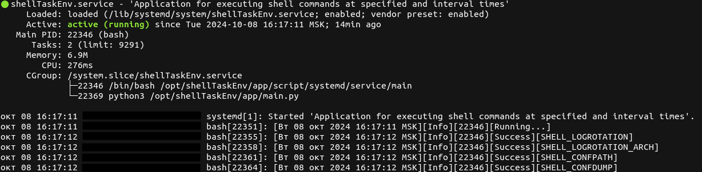

Инструкция по работе с приложением 'shellTaskEnv'.
---
Приложение 'shellTaskEnv' предназначено для упрощения работы с задачами в среде командной строки, которые можно выполнять в указанное время. В этой инструкции мы рассмотрим основные функции и возможности приложения.
### Содержание:
---
1. [Установка.](#1-установка)
* 1.1 [Настройка и запуск вручную.](#11-настройка-и-запуск-вручную)
* 1.2 [Автоматическая настройка и запуск systemd.](#12-автоматическая-настройка-и-запуск-systemd)
2. [Управление приложением.](#2-управление-приложением)
* 2.1 [Настройка директивы TASK.](#21-настройка-директивы-task)
    * 2.1.1 [Настройка интервальных задач.](#211-настройка-интервальных-задач)
    * 2.1.2 [Настройка плановых задач.](#212-настройка-плановых-задач)
* 2.2 [Настройка директивы LOGROTATION.](#22-настройка-директивы-logrotation)
* 2.3 [Настройка директивы CONFDUMP.](#23-настройка-директивы-confdump)

### 1. Установка.
---
Для установки приложения выполните следующие команды:
```
cd /opt
sudo git clone https://github.com/AlexKira/shellTaskEnv.git
sudo chown <username>:<usergroup> -R /opt/shellTaskEnv/
```
> **Примечание:**\
    При выполнении команды `chown` вместо директив:\
    `<username>` - подставьте своего пользователя;\
    `<usergroup>` - подставьте имя пользовательской группы.

### 1.1 Настройка и запуск вручную.
---
Для настройки и запуска приложения вручную выполните следующие команды:
```
cd /opt/shellTaskEnv/
python3 -m venv .venv
source .venv/bin/activate
python3 app/main.py
# Выход
CTRL + C
```
После выполнения команд, в каталоге `/opt/shellTaskEnv` появятся два подкаталога `log`, `settings`.\
`log` - это подкаталог, в котором хранятся файлы с выходными данными приложения. Файл по умолчанию `shellLogEnvApp.log`.\
`settings` - это подкаталог, в котором хранится основной файл конфигураций `conf.json`.\
Далее ниже будет описание взаимодействия с этими подкаталогами.

### 1.2 Автоматическая настройка и запуск systemd.
---

> **Примечание:**\
    Данная установка была протестирована на операционных системах семейства Debian.

Чтобы автоматически настроить и установить приложение в systemd, выполните следующие команды:
```
cd /opt/shellTaskEnv/app/script/systemd
chmod +x info
chmod +x install
chmod +x uninstall
```
Разберем данные bash-скрипты.
- `info` - это bash-скрипт для получения информации о состоянии сервиса `shellTaskEnv.service`, запускается от обычного пользователя;
- `install` - это bash-скрипт для установки и настройки сервиса `shellTaskEnv.service`, запускается от пользователя `root`;
- `uninstall` - это bash-скрипт для удаления сервиса `shellTaskEnv.service`, запускается от пользователя `root`;

Далее для установки выполните следующий шаг:
```
sudo ./install
# или
sudo bash install
```
После чего появится, вот такой статус:


> **Примечание:**\
    Если у вас статус `inactive`, проверьте шаги установки по данной инструкции и проверьте системный лог сервиса `shellTaskEnv.service`. Вы можете запустить скрипт `info` или использовать команду `journalctl -u shellTaskEnv.service --lines=20`. Эта команда выведет последние 20 строк лога, относящихся к сервису, что поможет вам диагностировать проблему. Предполагается, что вы понимаете работу системной службы `systemd` и можете решить проблему самостоятельно.

Далее, после проделанных операций, появится лог-файл `shellEnvAppService.log` в подкаталоге `log`, где записываются выходные данные работы сервиса `shellTaskEnv.service`.

Для управления сервисом `shellTaskEnv.service` используются следующие команды:
```
# Запросить статус
systemctl status shellTaskEnv.service 

# Запросить остановку
sudo systemctl stop shellTaskEnv.service

# Запросить запуск
sudo systemctl start shellTaskEnv.service

# Запросить перезапуск
sudo systemctl restart shellTaskEnv.service
```

> **Примечание:**\
    Управление сервисом `shellTaskEnv.service` осуществляется пользователем `root`, который имеет полный доступ к системе и может выполнять любые административные задачи.


Если сервис `shellTaskEnv.service` не нужен, выполните процедуру удаления следующей командой:
```
sudo ./uninstall
# или
sudo bash uninstall
```

### 2. Управление приложением.
---
Для управления приложением `shellTaskEnv`, предусмотрен файл `conf.json`, находящийся в подкаталоге `/opt/shellTaskEnv/settings`,который содержит различные конфигурационные параметры. Рассмотрим директивы:

- `CONFPATH` - это путь до главного файла настроек, по умолчанию `/opt/shellTaskEnv/settings/conf.json`;

- `TASK` — это настройка выполнения команд по установленной дате и времени ([ссылка](#21-настройка-директивы-task));

- `LOGROTATION` — это настройка архивирования, очистки и удаления лог-файлов приложения. Она позволяет управлять размером логов и предотвращает переполнение дискового пространства, обеспечивая автоматическое удаление старых записей ([ссылка](#22-настройка-директивы-logrotation));

- `CONFDUMP` — это настройка архивирования главного файла настроек приложения. По умолчанию архивирование осуществляется в подкаталоге `/opt/shellTaskEnv/dump`, где создается файл с именем `copy_conf.json`. Этот процесс позволяет сохранять резервные копии конфигурации и восстанавливать их в случае необходимости ([ссылка](#23-настройка-директивы-confdump)).

### 2.1 Настройка директивы TASK.
---
Директива `TASK` в файле конфигурации `settings/conf.json` используется для настройки выполнения задач по установленному расписанию. Давайте подробнее рассмотрим структуру этой директивы:
```
"TASK": {
    "0": {
        "DATE_TIME": {
            "MONTH": "",
            "DAYS": "",
            "HOURS": "",
            "MINUTE": ""
        },
        "EXECUTE": {
            "SHELL": []
        }
    }
}

# Схема(JSON):
"string": {
    "string": {
        "string": {
            "string": string,
            "string": string,
            "string": string,
            "string": string
        },
        "string": {
            "string": array
        }
    }
}
```
**Пояснение компонентов**:

- `TASK`- это основная директива, содержащая все задачи, которые будут выполняться.

- `0` - это идентификатор задачи от `0` до `n`. Каждая задача имеет уникальный идентификатор. В данном случае это `0`, но вы можете добавлять больше задач с другими идентификаторами.

- `DATE_TIME` - это объект определяет расписание для выполнения задач: 
    - `MONTH` - yказывает месяц, в котором должна выполняться задача. Можно использовать значения от 1 до 12.
    - `DAYS` - yказывает дни месяца, когда задача должна выполняться. Можно указать конкретные дни.
    - `HOURS` - yказывает часы выполнения задачи (от 0 до 23).
    - `MINUTE` - yказывает минуты выполнения задачи (от 0 до 59).
- `EXECUTE` - это объект определяет, какие команды должны быть выполнены:
    - `SHELL`- это массив для добавления команд, которые будут выполнены в соответствии с заданным расписанием.

Задачи делятся на два типа: `IntervalTask` и `PlanTask`.\
`IntervalTask` - это задачи которые выполняются c установленным [интервалом.](#211-настройка-интервальных-задач) \
`PlanTask` - это задачи которые выполняются по [плановому](#212-настройка-плановых-задач) времени `n` раз в год, месяц, день, часы или минуты.

**Символы, используемые для добавления задач:**:

- `""` - состояние отключено.
- `*` - состояние включено, добавляется текущая дата или время.
- `*/n` или `*/n.n` или `n.n` - это добавление для `IntervalTask`, тип добавления __целые__ или __числа с плавающей точкой__.
- `*n` или `n` - это добавление для `PlanTask`, тип добавления __строго целые числа__.

> **Примечание:**\
    Если вы используете сервис `shellTaskEnv.service`, то после изменений в файле `settings/conf.json` перезапустите сервис командой: `sudo systemctl restart shellTaskEnv.service`. После этого все настройки будут применены. Перезапуск сервиса позволяет системе заново загрузить конфигурацию и применить внесенные изменения.


### 2.1.1 Настройка интервальных задач.
---
Рассмотрим подходы к постановке "`IntervalTask` задачи.
```
"0": {
    "DATE_TIME": {
        "MONTH": "*",
        "DAYS": "*",
        "HOURS": "*",
        "MINUTE": "*/1"
    },
    "EXECUTE": {
        "SHELL": [
            "cat /proc/meminfo",
            "python3 -c 'import this'"
        ]
    }
}
```
После установки данных параметров задача будет выполняться раз в  `1` минуту. Для подтверждения того, что задача была добавлена на выполнение, перейдите в лог-файл: `log/shellLogEnvApp.log`. В этом файле вы сможете увидеть записи о выполнении вашей задачи. После выполнения задачи она автоматически продлится на следующую минуту, что означает, что она будет продолжать выполняться с заданным интервалом. Это позволяет вам не беспокоиться о ручном запуске задачи каждый раз.

Если вы в параметре `MINUTE` укажете число с плавающей точкой, то данное время будет рассчитываться в `секундах`. Это справедливо только по отношению к параметру `MINUTE`.\
**Пример**:
```
"0": {
        "DATE_TIME": {
            "MONTH": "*",
            "DAYS": "*",
            "HOURS": "*",
            "MINUTE": "*/10.5"
        },
        "EXECUTE": {
            "SHELL": [
                "cat /proc/meminfo",
                "python3 -c 'import this'"
            ]
        }
    }
```
Данная задача будет интерпретироваться как `10 секунд` и `100 миллисекунд`. Важно помнить, что для других параметров, таких как `HOURS`, `DAYS` и `MONTH`, использование чисел с плавающей точкой не имеет такого же эффекта и будет работать по стандартным правилам.


> **Примечание:**\
    Важно отметить, что если хоть одно поле будет пустым`""`, то задача будет проигнорирована. Поэтому в поля, которые вы используете, рекомендуется вставлять символ `"*"`, чтобы обозначить, что это поле принимает текущее значение даты или времени.

Последний вариант запуска задач — это использование чисел строго с плавающей точкой.\
**Пример**:
```
"0": {
    "DATE_TIME": {
        "MONTH": "*",
        "DAYS": "*",
        "HOURS": "*",
        "MINUTE": "10.5"
    },
    "EXECUTE": {
        "SHELL": [
            "cat /proc/meminfo",
            "python3 -c 'import this'"
        ]
    }
}
```
Такой вариант постановки тоже будет верный.

### 2.1.2 Настройка плановых задач.
---
В разработке!!!!!!

### 2.2 Настройка директивы LOGROTATION.
---
В разработке!!!!!!

### 2.3 Настройка директивы CONFDUMP.
---
В разработке!!!!!!